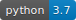
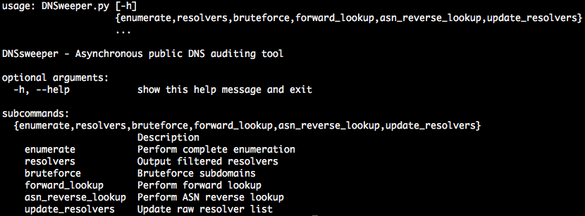
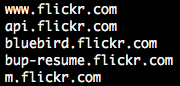

<p align="center"></p>



***

## Synopsis

DNSweeper is DNS auditing tool written in python which uses asynchronous libraries for querying and extracting DNS data from public resolvers around the globe. This tool is designed to extend information about given domain and subdomains and it works best if you feed it with already scraped subdomains.

## Installation

Clone DNSweeper repo

`$ git clone https://github.com/MMquant/DNSweeper.git`

Install python headers (needed for pycares)

`$ apt install python3.7-dev`

Install dependencies from `requirements.txt`:

`$ pip3 install -r requirements.txt`

## Introduction

Main help screen



DNSweeper consists of 6 commands:

* *enumerate*
* *resolvers*
* *bruteforce*
* *forward_lookup*
* *asn\_reverse_lookup*
* *update_resolvers*

General design idea is that *enumerate* command uses *resolvers*, *bruteforce*, *forward_lookup* and *asn\_reverse_lookup* commands all together. By extracting particular subcommands we get more flexibility and we can fine tune the DNS enumeration process.

## Examples

### Using help

Every command has its own help switch

```
$ python DNSweeper.py -h
$ python DNSweeper.py enumerate -h
$ python DNSweeper.py resolvers -h
...
```

Before running prepare file with scraped subdomains ie. `scraped_subdomains.txt`



<br>

#### `enumerate`

*enumerate* command runs following commands:

1. *resolvers*
2. *bruteforce*
3. *forward_lookup*
4. *asn\_reverse_lookup*

**Basic use**

Input from file

`$ python3 DNSweeper.py enumerate -f scraped_subdomains.txt`

Input domain directly

`$ python3 DNSweeper.py enumerate -d test_domain.com`

**Custom payload file**

`$ python3 DNSweeper.py enumerate -f scraped_subdomains.txt -p path/to/payload`

**Custom output directory**

`$ python3 DNSweeper.py enumerate -f scraped_subdomains.txt -o results/directory/`

**Skip *bruteforce* and increase verbosity**

`$ python3 DNSweeper.py enumerate -f scraped_subdomains.txt --no-bruteforce -v`

<br>

#### `resolvers`

*resolvers* command filters-out bad resolvers and outputs usable resolvers to `filtered_resolvers_result.json`

**Basic use**

`$ python3 DNSweeper.py resolvers -d testing_domain.com`

<br>

#### `bruteforce`

*bruteforce* command bruteforces subdomains of given domain

**Basic use**

`$ python3 DNSweeper.py bruteforce -d testing_domain.com`

<br>

#### `forward_lookup`

*forward_lookup* command searches filtered public resolvers for A records

**Basic use**

`$ python3 DNSweeper.py forward_lookup -f scraped_subdomains.txt`

<br>

#### `asn_reverse_lookup`

*asn\_reverse_lookup* command queries filtered resolvers for A records against ASN database and discovered netblocks are in turn queried for PTR records

**Basic use**

`$ python3 DNSweeper.py asn_reverse_lookup -f ips.txt`

**Use custom regexp to filter gathered PTR records. Filtered records are stored in**
`result/asn_reverse_lookup_regex_ptr.json`

`$ python3 DNSweeper.py asn_reverse_lookup -f ips.txt -r admin`

<br>

#### `update_resolvers`

*update_resolvers* command downloads fresh unfiltered public resolvers list

**Basic use**

`$ python3 DNSweeper.py update_resolvers`

<br>

## Advanced switches

<br>

#### `--use-cache`

DNSweeper has very basic caching capabilities. Each of the following commands creates `cache` directory in current working directory.

* *enumerate*
* *resolvers*
* *bruteforce*
* *forward_lookup*
* *asn\_reverse_lookup*

`cache` directory contains cached filtered resolvers which can be reused by any command which support `--use-cache` switch.

<br>

#### `--fast-sweep`

DNSweeper core works in two sweep modes - *names*, *resolvers*.

In *names* sweep mode DNSweeper uses underlying c-ares channel asynchronicity. In human language DNSweeper requests subdomains randomly by first available resolver. If DNSweeper gets valid DNS answer from randomly selected resolver it considers given subdomain as resolved and doesn't resolve the same subdomain with another resolvers.


In *resolvers* sweep mode DNSweeper creates as many c-ares channel objects as there are public resolvers. In layman's terms every subdomain is resolved by each resolver separately.

*names* sweep mode is naturally much faster but we skip many DNS answers. Overall performance is 300-1100 req/s.

*resolvers* sweep mode is slower but we get huge amount of data. Overall performance is 130 req/s.

`--fast-sweep` forces commands to use *names* sweep mode.

<br>

#### `--exclude FILE`

Path to file with out-of-scope subdomains. File can contain even regexps in the following form `R/some_regexp`.

**Example:**

```
www.flickr.com
devtools.flickr.com
scouts.flickr.com
widgets.flickr.com
R/news[0-9]*\.
R/gov[0-9]*\.

```

<br>

#### `--bruteforce-recursive FILE`

Bruteforce recursively and use payload from FILE. Default bruteforce wordlist or custom wordlist is not used here. Use smaller wordlist for recursive bruteforcing (5k-10k).

<br>

#### `-vvv`

`-v -vv -vvv` switches DNSweeper verbosity.

<br>

## Results structure

<br>

By running any of following commands 

* *enumerate*
* *resolvers*
* *bruteforce*
* *forward_lookup*
* *asn\_reverse_lookup*

the `results/` directory is created in current working directory which contains files with given command output.

```
results/
├── asn_reverse_lookup_all_ptr.json
├── asn_reverse_lookup_asn.json
├── asn_reverse_lookup_regex_ptr.json
├── bruteforce_result.json
├── filtered_resolvers_result.json
├── enumerate_unique_subdomains.json
├── forward_lookup_result.json
└── forward_lookup_unique_ips.json
```

`asn_reverse_lookup_all_ptr.json` contains complete asn\_reverse_lookup command PTR records

```
[{"ip":"119.161.14.0","name":"UNKNOWN-119-161-14-X.yahoo.com"},{"ip":"119.161.14.1","name":"ha1.vl12 ...
```

`asn_reverse_lookup_asn.json` contains all discovered ASNs information sorted by unique ASNs

```
[
  {
    "AS":"24376",
    "IP":"119.161.14.17",
    "BGP Prefix":"119.161.14.0/23",
    "CC":"KR",
    "Registry":"apnic",
    "Allocated":"2008-02-22",
    "Info":"YAHOO-CN2-AP Yahoo China Datacenter, CN"
  },
  ...
```

`asn_reverse_lookup_regex.json` contains regexp filtered records from `asn_reverse_lookup` command

`bruteforce_result.json` contains all discovered subdomains by brute_force command

```
[
  "bots.flickr.com",
  "devtools.flickr.com",
  "developer.flickr.com",
  "login.flickr.com",
  "static14.flickr.com",
  ...
```

`filtered_resolvers_result.json` contains filtered resolvers used for current session

```
[
  "203.119.36.106",
  "213.92.199.54",
  "190.54.110.23",
  "125.132.89.145",
  "24.230.153.195",
  "84.47.135.146",
  "12.13.191.66",
...
```

`enumerate_unique_subdomains.json` contains all unique subdomains discovered by enumerate command. Basically it's concatenation of `bruteforce_result.json` and `asn_reverse_lookup_regex_ptr.json` and it was created just for making later scripting easier.

`forward_lookup_result.json` contains A records from public resolvers for all enumerated subdomains

```
  ...
  {
    "name":"devtools.flickr.com",
    "A":[
      "10.89.12.203"
    ]
  },
  {
    "name":"developer.flickr.com",
    "A":[
      "74.6.136.153"
    ]
  },
  {
    "name":"login.flickr.com",
    "A":[
      "52.85.231.80",
      "52.85.231.40",
      "52.85.231.38",
      "52.85.231.22"
    ]
  },
  ...
```

`forward_lookup_unique_ips.json` contains unique A records from `forward_lookup_result.json`

```
[
  "119.161.14.18",
  "119.161.16.11",
  "119.161.4.151",
  ...
```

## ToDo

* optimize code for Windows (maximum count of opened file descriptors)
* tune-up resolvers filtering - adding more filters, upgrade current filtering
* upgrade installation process (create package?)

## Contribution

1. Fork `DNSweeper` repository.
2. Commit to your ***develop*** branch.
3. Create pull request from your ***develop*** branch to ***origin/develop*** branch.

No direct pull request to ***master*** branch accepted!

## Author

Petr Javorik [www.mmquant.net](www.mmquant.net) [maple@mmquant.net](maple@mmquant.net)